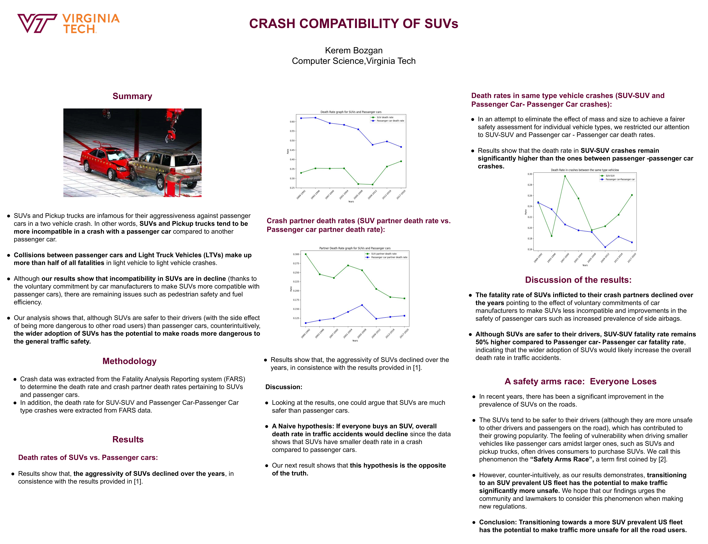

# Crash Compatibility of SUVs
Analyzed car crash fatalities in the **Fatality Analysis Reporting System (FARS)** database and found that **SUV-to-SUV crashes are ~50% more fatal** than passenger-car-to-passenger-car crashes — which counterintuitively suggests that the U.S. fleet's transition toward SUVs has the potential to make road traffic *more* dangerous overall, not safer.

🏆 2nd place, *Distracted Driving Summit* poster competition.

